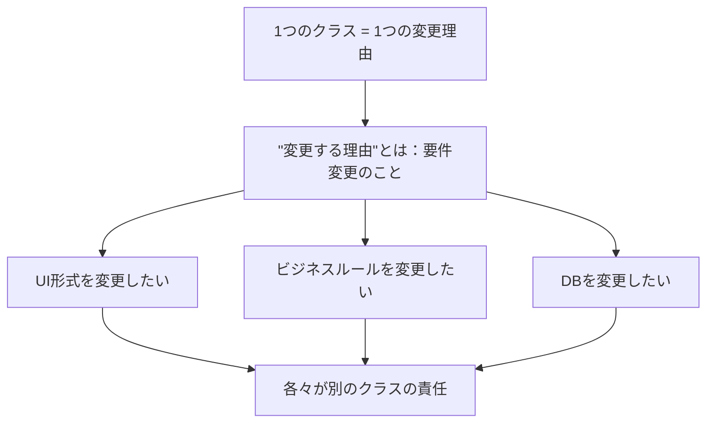
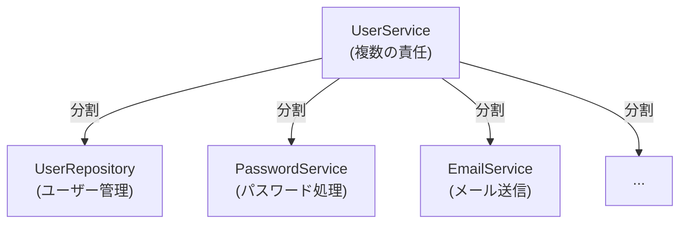
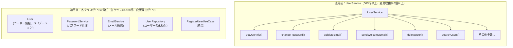

# 01. 単一責任の原則 (SRP) - Single Responsibility Principle

> **原則**: クラスは変更する理由が1つだけであるべき。言い換えれば、クラスは1つの責任だけを持つべき。

## 🎯 コンセプト



---

## ❌ SRPに違反する例

### 例：複数の責任が1つのクラスに

```typescript
// ❌ 悪い例：UserService が複数の責任を持っている

export class UserService {
  // 責任1: ユーザー情報の管理
  async getUserInfo(userId: string) {
    const user = await this.db.query(
      'SELECT * FROM users WHERE id = ?',
      [userId]
    );
    return user;
  }

  // 責任2: パスワードの処理
  async changePassword(userId: string, newPassword: string) {
    const hashedPassword = bcrypt.hashSync(newPassword, 10);
    await this.db.query(
      'UPDATE users SET password = ? WHERE id = ?',
      [hashedPassword, userId]
    );
  }

  // 責任3: ユーザーのバリデーション
  validateEmail(email: string): boolean {
    return /^[^\s@]+@[^\s@]+\.[^\s@]+$/.test(email);
  }

  // 責任4: メール送信
  async sendWelcomeEmail(email: string) {
    await this.emailService.send(
      email,
      'Welcome!',
      'Welcome to our service!'
    );
  }

  // 責任5: ユーザーの削除
  async deleteUser(userId: string) {
    await this.db.query('DELETE FROM users WHERE id = ?', [userId]);
  }

  // 責任6: ユーザー検索
  async searchUsers(query: string) {
    return await this.db.query(
      'SELECT * FROM users WHERE name LIKE ?',
      [`%${query}%`]
    );
  }
}
```

**問題:**
- 🔴 500行以上のクラス
- 🔴 メールサービス仕様を変更
  → UserServiceを修正 ❌
- 🔴 パスワード暗号化方式を変更
  → UserServiceを修正 ❌
- 🔴 DBをPostgreSQLに変更
  → UserServiceを修正 ❌
- 🔴 テストが複雑（全ての責任をモックする必要）

---

## ✅ SRP を適用した設計



### Step 1: 責任ごとにクラスを分割

```typescript
// ##### ドメイン層 #####

// 責任1: ユーザー情報の保持・検証
export class User {
  private id: string;
  private email: string;
  private hashedPassword: string;

  constructor(id: string, email: string, hashedPassword: string) {
    if (!this.isValidEmail(email)) {
      throw new InvalidEmailError(email);
    }
    this.id = id;
    this.email = email;
    this.hashedPassword = hashedPassword;
  }

  getId(): string {
    return this.id;
  }

  getEmail(): string {
    return this.email;
  }

  private isValidEmail(email: string): boolean {
    return /^[^\s@]+@[^\s@]+\.[^\s@]+$/.test(email);
  }
}

// ##### アプリケーション層 #####

// 責任2: パスワード処理
export class PasswordService {
  // パスワードのハッシング
  hashPassword(password: string): string {
    return bcrypt.hashSync(password, 10);
  }

  // パスワードの検証
  verifyPassword(plainPassword: string, hashedPassword: string): boolean {
    return bcrypt.compareSync(plainPassword, hashedPassword);
  }
}

// 責任3: メール送信
export class EmailService {
  async sendWelcomeEmail(email: string): Promise<void> {
    await this.sendEmail(
      email,
      'Welcome!',
      'Welcome to our service!'
    );
  }

  async sendPasswordResetEmail(email: string, resetToken: string): Promise<void> {
    await this.sendEmail(
      email,
      'Password Reset',
      `Click here to reset: ${resetToken}`
    );
  }

  private async sendEmail(to: string, subject: string, body: string): Promise<void> {
    // メール送信実装
  }
}

// 責任4: ユーザー保存・取得（リポジトリ）
export interface UserRepository {
  save(user: User): Promise<void>;
  findById(userId: string): Promise<User | null>;
  findByEmail(email: string): Promise<User | null>;
  delete(userId: string): Promise<void>;
  search(query: string): Promise<User[]>;
}

// ##### インフラストラクチャ層 #####

// 責任5: MySQL実装
export class MySQLUserRepository implements UserRepository {
  constructor(private db: Database) {}

  async save(user: User): Promise<void> {
    await this.db.query(
      'INSERT INTO users (id, email, password) VALUES (?, ?, ?)',
      [user.getId(), user.getEmail(), user.hashedPassword]
    );
  }

  async findById(userId: string): Promise<User | null> {
    const row = await this.db.query(
      'SELECT * FROM users WHERE id = ?',
      [userId]
    );
    return row ? new User(row.id, row.email, row.password) : null;
  }

  // ... 他のメソッド
}
```

### Step 2: ユースケースで統合

```typescript
// ##### アプリケーション層 #####

// ユーザー登録のユースケース
export class RegisterUserUseCase {
  constructor(
    private userRepository: UserRepository,
    private passwordService: PasswordService,
    private emailService: EmailService,
    private generateId: () => string
  ) {}

  async execute(request: RegisterUserRequest): Promise<RegisterUserResponse> {
    // 既存ユーザーをチェック
    const existing = await this.userRepository.findByEmail(request.email);
    if (existing) {
      throw new UserAlreadyExistsError(request.email);
    }

    // ユーザーを作成（ドメイン層は自動的にバリデーション）
    const user = new User(
      this.generateId(),
      request.email,
      this.passwordService.hashPassword(request.password)
    );

    // 保存
    await this.userRepository.save(user);

    // メール送信
    await this.emailService.sendWelcomeEmail(user.getEmail());

    return {
      id: user.getId(),
      email: user.getEmail()
    };
  }
}
```

---

## 📊 SRP適用前後の比較



---

## 📊 テストの容易性

### SRP適用後のテスト

```typescript
// PasswordService のテスト（インフラ依存なし）
describe('PasswordService', () => {
  test('should hash password', () => {
    const service = new PasswordService();
    const hashed = service.hashPassword('password123');
    
    expect(hashed).not.toBe('password123');
    expect(service.verifyPassword('password123', hashed)).toBe(true);
  });
});

// EmailService のテスト（実メール送信なし）
describe('EmailService', () => {
  test('should send welcome email', async () => {
    const mockSender = jest.fn();
    const service = new EmailService(mockSender);
    
    await service.sendWelcomeEmail('user@example.com');
    
    expect(mockSender).toHaveBeenCalledWith(
      expect.objectContaining({
        to: 'user@example.com',
        subject: 'Welcome!'
      })
    );
  });
});

// RegisterUserUseCase のテスト（各部品をモック）
describe('RegisterUserUseCase', () => {
  test('should register new user', async () => {
    const mockRepository = {
      findByEmail: jest.fn().mockResolvedValue(null),
      save: jest.fn()
    };
    const mockPasswordService = {
      hashPassword: jest.fn().mockReturnValue('hashed')
    };
    const mockEmailService = {
      sendWelcomeEmail: jest.fn()
    };

    const useCase = new RegisterUserUseCase(
      mockRepository,
      mockPasswordService,
      mockEmailService,
      () => 'user-id'
    );

    await useCase.execute({
      email: 'new@example.com',
      password: 'pass123'
    });

    expect(mockRepository.save).toHaveBeenCalled();
    expect(mockEmailService.sendWelcomeEmail).toHaveBeenCalled();
  });
});
```

---

## 🎯 SRP チェックリスト

```
✅ クラスを説明するとき、"かつ" や "および" が出ないか確認
✅ クラスの変更理由が1つだけか
✅ クラスのテストに1つのテストクラスで十分か
✅ クラスの行数が100行以下か
✅ メソッドが5個以下か
✅ クラスの名前が簡潔か
```

---

## 📋 まとめ

| ポイント | 説明 |
|---------|------|
| **本質** | 1つの理由だけで変更すべき |
| **単位** | クラス、メソッド、モジュール |
| **メリット** | テスト容易、保守容易、再利用性 |
| **見分け方** | 変更理由が複数あるか |

---

## ➡️ 次のステップ

次は、拡張に対しては開放的に、修正に対しては閉鎖的であるべき、という **開放閉鎖の原則** を学びます。

[次: 開放閉鎖の原則 →](./02-open-closed.md)
