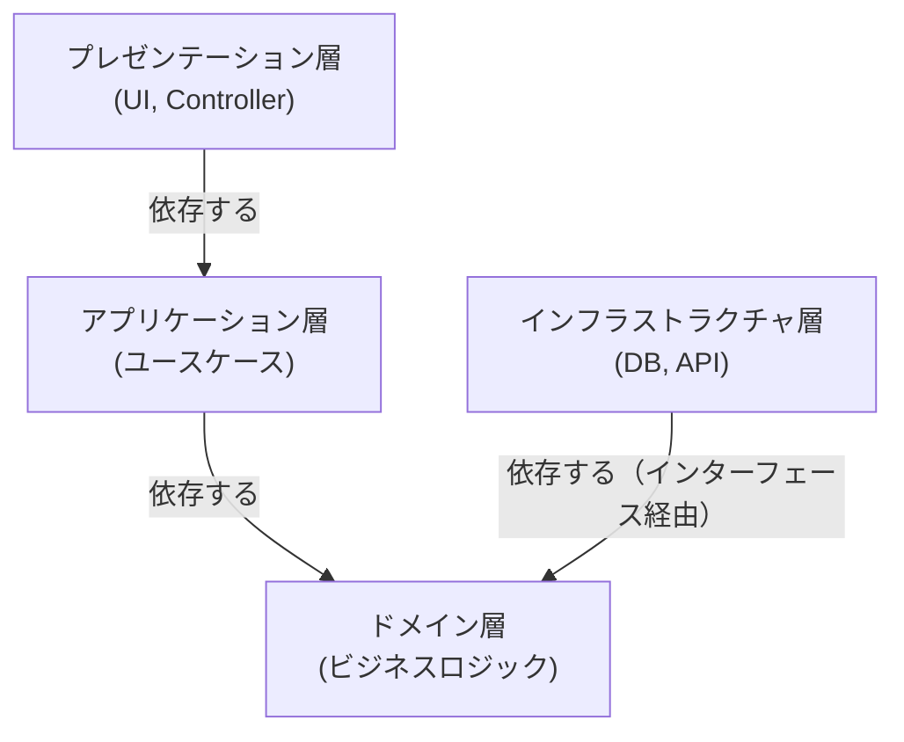
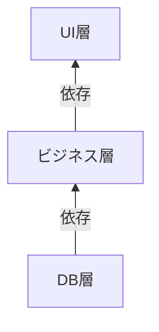
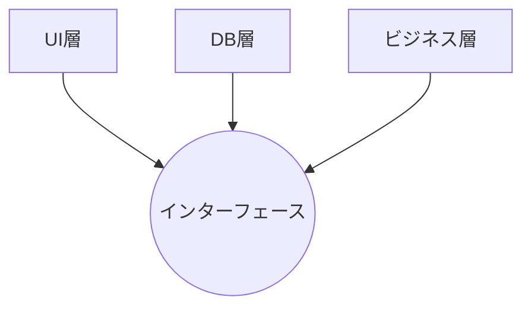
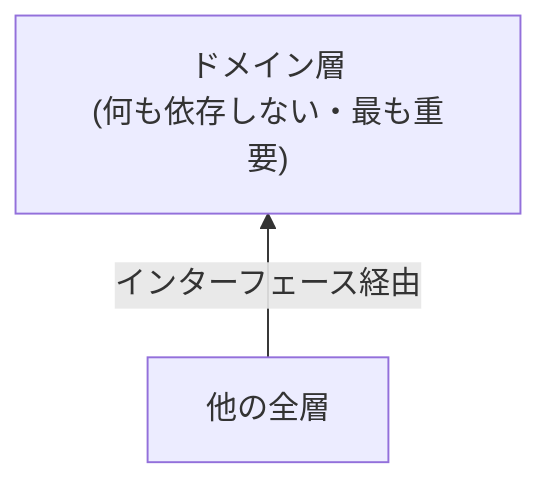

# 層の依存関係ルール (Layer Dependency Rules)

> **最も重要なルール**: 内側の層は外側の層に依存しない。外側の層が内側の層に依存する一方向のみ。

## 🧭 このページの前提：Clean Architectureの3原則

Clean Architectureの目的は、**業務ロジックを技術的な実装から守ること**です。そのために「①関心事を分離する → ②境界を定義する → ③依存方向を制御する」の順で原則を適用します（全体像は [01-overview.md](../01-introduction/01-overview.md#-本質3つの原則) 参照）。このページは③を主題としますが、③は①②を正しく行った**結果**にすぎません。まず①②がこの4層でどう表れるかを確認してから、③のルールに入ります。

### ①②の適用：各層は「What」と「How」のどちらを担うか

| 層 | 問いかけ | 責務（関心事） | 具体例 |
|---|---|---|---|
| ドメイン層 | 何を実現すべきか（What） | 業務ルールそのもの。技術に関係なく成立する知識 | 「注文金額は0円より大きくなければならない」 |
| アプリケーション層 | どのような業務フローで実現するか（How: 手順） | ドメインオブジェクトを呼び出す順序・手順書 | 「注文を作成→在庫を引当→決済→確認メール送信、の順で呼び出す」 |
| インフラストラクチャ層 | 具体的にどうやってDBやAPIを使うか（How: 技術詳細） | ユースケースが要求する処理の技術的な実現方法 | 「MySQLのINSERT文で保存する」「Stripe APIで課金する」 |
| プレゼンテーション層 | どんな入出力形式で呼び出すか（How: インターフェース形式） | ユースケースをHTTP/CLI/GraphQLなどにつなぐ | 「HTTPリクエストのJSONをユースケースの引数に変換する」 |

境界の意味は、**変更理由が異なるコードを別のファイル・別の層に分けること**にあります。「割引ルールを変える」変更と「DBをPostgreSQLに移行する」変更は理由がまったく別物であり、同じ場所にあるべきではありません。この責務分離ができていないと、業務ルールを変えたいだけなのにDBのコードまで触る、といった問題が起きます（各層の責務の詳細は [03-domain-layer.md](03-domain-layer.md)・[02-application-layer.md](02-application-layer.md)・[04-infrastructure-layer.md](04-infrastructure-layer.md) 参照）。

境界が決まったら、次はその境界をまたぐ矢印の**向き**を制御します。ここからが本題の依存方向ルールです。

## 🎯 依存方向の基本ルール



重要：この矢印と逆方向の依存は禁止。インフラストラクチャ層はドメイン層が定義するインターフェースを実装する形で依存する（依存性逆転）。ドメイン層自身は他のどの層にも依存しない。

---

## ❌ 違反パターン

### 違反1：ドメイン層が外部フレームワークに依存

```typescript
// ❌ ダメな例：ドメイン層が Express に依存

import express = require('express');

export class User {
  constructor(private req: express.Request) {
    // Express がないとドメイン層が使えない
  }

  processLogin(): express.Response {
    // Express に依存している
  }
}
```

**問題:**
- Express がなければ動かない
- テストが困難（Express をセットアップ必須）
- フレームワーク変更が大変

---

### 違反2：ドメイン層が DB に直接依存

```typescript
// ❌ ダメな例：ドメイン層が MySQL に依存

import mysql = require('mysql');

export class Order {
  async getTotalPrice(): Promise<number> {
    const connection = mysql.createConnection({...});
    const result = await connection.query('SELECT SUM(price) FROM items');
    // DB がないとドメイン層が使えない
  }
}
```

**問題:**
- テスト時に DB 起動が必須
- DB を変更できない
- ビジネスロジックと DB 方言が混在

---

### 違反3：アプリケーション層がプレゼンテーション層に依存

```typescript
// ❌ ダメな例：アプリケーション層が HTTP に依存

import { Response } from 'express';

export class RegisterUserUseCase {
  async execute(req: Request, res: Response): Promise<void> {
    // HTTP ステータスコード
    res.status(201).json({...});
    // プレゼンテーション層への依存
  }
}
```

**問題:**
- CLI から呼べない
- GraphQL 対応できない
- ユースケース がプレゼンテーション形式に依存

---

## ✅ 正しいパターン

### 正しいパターン1：依存性逆転で抽象化

```typescript
// ✅ 良い例：インターフェースで抽象化

// ドメイン層：抽象化
export interface UserRepository {
  save(user: User): Promise<void>;
  findById(id: string): Promise<User | null>;
}

// ドメイン層：ビジネスロジック
export class User {
  constructor(id: string, email: string, password: string) {
    // 外部ツールに依存しない
  }
}

// アプリケーション層：インターフェース経由
export class RegisterUserUseCase {
  constructor(private userRepository: UserRepository) {}

  async execute(request: RegisterRequest): Promise<RegisterResponse> {
    const user = new User(uuid(), request.email, request.password);
    await this.userRepository.save(user);  // インターフェース使用
    return { id: user.getId(), email: user.getEmail() };
  }
}

// インフラストラクチャ層：具体的実装
export class MySQLUserRepository implements UserRepository {
  async save(user: User): Promise<void> {
    await this.db.query('INSERT INTO users ...', [...]);
  }
}

// プレゼンテーション層：複数メディア対応可能
export class UserRESTController {
  constructor(private registerUseCase: RegisterUserUseCase) {}

  async register(req: Request, res: Response): Promise<void> {
    const result = await this.registerUseCase.execute(req.body);
    res.status(201).json(result);
  }
}

export class UserCLICommand {
  constructor(private registerUseCase: RegisterUserUseCase) {}

  async execute(email: string, password: string): Promise<void> {
    const result = await this.registerUseCase.execute({ email, password });
    console.log(`User created: ${result.id}`);
  }
}
```

---

## 📊 依存関係の図解

### ❌ 違反設計



問題：下位層の変更が上位層全体に影響

### ✅ 正しい設計（依存性逆転）



すべてがインターフェースに依存

---

## 💻 実装例：複雑なユースケース

### ステップ1：ドメイン層（フレームワーク独立）

```typescript
// domain/entity/PaymentTransaction.ts
export class PaymentTransaction {
  private amount: Money;
  private status: TransactionStatus;

  constructor(amount: Money) {
    if (amount.getAmount() <= 0) {
      throw new InvalidAmountError();
    }
    this.amount = amount;
    this.status = TransactionStatus.PENDING;
  }

  complete(): void {
    this.status = TransactionStatus.COMPLETED;
  }

  fail(reason: string): void {
    this.status = TransactionStatus.FAILED;
  }

  // フレームワークに依存しない純粋なビジネスロジック
}

// domain/repository/PaymentTransactionRepository.ts
export interface PaymentTransactionRepository {
  save(transaction: PaymentTransaction): Promise<void>;
  findById(id: string): Promise<PaymentTransaction | null>;
}

// domain/service/PaymentProcessingService.ts
export interface PaymentProvider {
  charge(amount: number, paymentMethodId: string): Promise<ChargeResult>;
}

export class PaymentProcessingService {
  constructor(private paymentProvider: PaymentProvider) {}

  async processPayment(
    amount: Money,
    paymentMethodId: string
  ): Promise<PaymentTransaction> {
    const transaction = new PaymentTransaction(amount);

    try {
      const result = await this.paymentProvider.charge(
        amount.getAmount(),
        paymentMethodId
      );

      if (result.success) {
        transaction.complete();
      } else {
        transaction.fail(result.reason);
      }

      return transaction;
    } catch (error) {
      transaction.fail('Payment service error');
      throw error;
    }
  }
}
```

### ステップ2：アプリケーション層

```typescript
// application/usecase/ProcessPaymentUseCase.ts
export class ProcessPaymentUseCase {
  constructor(
    private paymentService: PaymentProcessingService,
    private transactionRepository: PaymentTransactionRepository,
    private notificationService: NotificationService
  ) {}

  async execute(request: ProcessPaymentRequest): Promise<ProcessPaymentResponse> {
    const amount = new Money(request.amount);

    // ドメインサービス呼び出し
    const transaction = await this.paymentService.processPayment(
      amount,
      request.paymentMethodId
    );

    // リポジトリで永続化
    await this.transactionRepository.save(transaction);

    // 通知サービス呼び出し
    if (transaction.isCompleted()) {
      await this.notificationService.sendPaymentConfirmation(
        request.email,
        transaction.getId()
      );
    }

    return {
      transactionId: transaction.getId(),
      status: transaction.getStatus(),
      amount: amount.getAmount()
    };
  }
}
```

### ステップ3：インフラストラクチャ層

```typescript
// infrastructure/persistence/MySQLPaymentRepository.ts
export class MySQLPaymentRepository implements PaymentTransactionRepository {
  async save(transaction: PaymentTransaction): Promise<void> {
    await this.db.query(
      'INSERT INTO payment_transactions (id, amount, status) VALUES (?, ?, ?)',
      [transaction.getId(), transaction.getAmount(), transaction.getStatus()]
    );
  }
}

// infrastructure/external/StripePaymentProvider.ts
export class StripePaymentProvider implements PaymentProvider {
  async charge(amount: number, paymentMethodId: string): Promise<ChargeResult> {
    try {
      const result = await stripe.paymentIntents.create({
        amount: amount * 100,
        payment_method: paymentMethodId,
        confirm: true
      });

      return {
        success: result.status === 'succeeded',
        chargeId: result.id,
        reason: result.last_payment_error?.message
      };
    } catch (error) {
      return {
        success: false,
        reason: 'API Error'
      };
    }
  }
}

// infrastructure/external/EmailNotificationService.ts
export class EmailNotificationService implements NotificationService {
  async sendPaymentConfirmation(email: string, transactionId: string): Promise<void> {
    await this.emailClient.send({
      to: email,
      subject: 'Payment Confirmed',
      template: 'payment-confirmation',
      variables: { transactionId }
    });
  }
}
```

### ステップ4：プレゼンテーション層

```typescript
// presentation/controller/PaymentController.ts
export class PaymentController {
  constructor(private processPaymentUseCase: ProcessPaymentUseCase) {}

  async handlePayment(req: Request, res: Response, next: NextFunction): Promise<void> {
    try {
      const result = await this.processPaymentUseCase.execute({
        amount: req.body.amount,
        paymentMethodId: req.body.paymentMethodId,
        email: req.body.email
      });

      res.status(200).json(result);
    } catch (error) {
      next(error);
    }
  }
}

// presentation/cli/PaymentCommand.ts
export class PaymentCommand {
  constructor(private processPaymentUseCase: ProcessPaymentUseCase) {}

  async execute(amount: number, methodId: string, email: string): Promise<void> {
    const result = await this.processPaymentUseCase.execute({
      amount,
      paymentMethodId: methodId,
      email
    });

    console.log(`Payment processed: ${result.transactionId}`);
  }
}
```

---

## 🧪 依存関係を意識したテスト

```typescript
describe('ProcessPaymentUseCase - Dependency Layers', () => {
  // モック：すべてインターフェースで提供
  const paymentService = new MockPaymentService();
  const repository = new MockRepository();
  const notification = new MockNotificationService();

  test('should respect dependency rules', async () => {
    const useCase = new ProcessPaymentUseCase(
      paymentService,
      repository,
      notification
    );

    // DB を知らずにテスト可能
    const result = await useCase.execute({
      amount: 100,
      paymentMethodId: 'pm_123',
      email: 'user@example.com'
    });

    expect(result.transactionId).toBeDefined();
    expect(repository.savedCount).toBe(1);
  });

  test('should work with different payment provider', async () => {
    // 実装を切り替え可能
    const differentProvider = new DifferentPaymentProvider();
    const useCase = new ProcessPaymentUseCase(
      new PaymentProcessingService(differentProvider),
      repository,
      notification
    );

    // 同じテストが動く
    const result = await useCase.execute({...});
    expect(result).toBeDefined();
  });
});
```

---

## 📋 層の依存関係チェックリスト

```
✅ 「What（業務ルール）」と「How（実現方法）」が同じファイルに混在していない
✅ 各層の責務が1つの問い（何を/どんな手順で/どうやって）で説明できる
✅ ドメイン層がフレームワークをインポートしていない
✅ ドメイン層が外部ライブラリをインポートしていない
✅ アプリケーション層が HTTP/CLI に依存していない
✅ リポジトリがインターフェースで定義されている
✅ 外部サービスがインターフェースで抽象化されている
✅ テストでモックが使用できる
✅ 実装を切り替え可能である
```

---

## 📊 全4層の依存関係まとめ

| 層 | 依存できる層 | 依存コンセプト |
|---|-----------|----------|
| **プレゼンテーション** | アプリケーション層 | UI形式 |
| **アプリケーション** | ドメイン層 | ユースケース |
| **ドメイン** | なし | ビジネスルール |
| **インフラストラクチャ** | ドメイン層（インターフェースを実装するため依存） | 実装詳細 |



---

## ➡️ 次のステップ

4層の理論を理解したので、次は **デザインパターン**を学びます。これらはクリーンアーキテクチャを実装するための具体的なパターンです。

[次: デザインパターン →](../04-design-patterns/)
