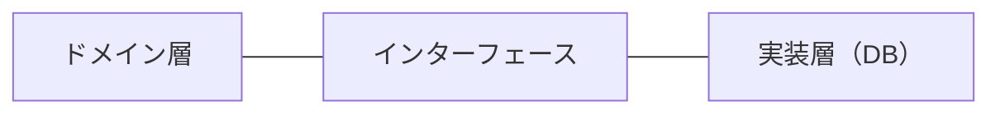

# 02. リポジトリパターン (Repository Pattern)

> **パターン**: データベース操作をカプセル化。ドメイン層がDB方言を知らない。

## 🎯 コンセプト



ドメイン層は、データの保存・取得がどのように
行われるかを知らない。

---

## 💻 実装

### Step 1: インターフェース定義（ドメイン層）

```typescript
export interface UserRepository {
  save(user: User): Promise<void>;
  getById(id: string): Promise<User | null>;
  getByEmail(email: string): Promise<User | null>;
  update(user: User): Promise<void>;
  delete(id: string): Promise<void>;
}
```

### Step 2: 実装（インフラ層）

```typescript
// MySQL実装
export class MySQLUserRepository implements UserRepository {
  async save(user: User): Promise<void> {
    const query = `INSERT INTO users VALUES (?, ?, ?)`;
    await this.db.execute(query, [user.id, user.email, user.name]);
  }

  async getById(id: string): Promise<User | null> {
    const result = await this.db.query(`SELECT * FROM users WHERE id = ?`, [id]);
    return result ? this.mapToEntity(result) : null;
  }
}

// MongoDB実装
export class MongoDBUserRepository implements UserRepository {
  async save(user: User): Promise<void> {
    await this.collection.insertOne({
      _id: user.id,
      email: user.email,
      name: user.name
    });
  }

  async getById(id: string): Promise<User | null> {
    const doc = await this.collection.findOne({ _id: id });
    return doc ? this.mapToEntity(doc) : null;
  }
}
```

### Step 3: 使用（アプリケーション層）

```typescript
export class GetUserUseCase {
  constructor(private userRepository: UserRepository) {}

  async execute(userId: string): Promise<User> {
    // DB実装を知らずに使用
    const user = await this.userRepository.getById(userId);
    if (!user) throw new UserNotFoundError();
    return user;
  }
}
```

---

## 🎯 メリット

```
✅ DB技術を隠蔽
✅ ビジネスロジックがDB方言に汚染されない
✅ テスト時にモック可能
✅ DB変更が容易（MySQLからPostgreSQLへ）
✅ 複数DB対応が簡単
```

---

## 🧪 テスト

```typescript
describe('GetUserUseCase', () => {
  test('should return user from repository', async () => {
    const mockRepository: UserRepository = {
      save: jest.fn(),
      getById: jest.fn().mockResolvedValue(new User('1', 'test@example.com', 'John')),
      getByEmail: jest.fn(),
      update: jest.fn(),
      delete: jest.fn()
    };

    const useCase = new GetUserUseCase(mockRepository);
    const user = await useCase.execute('1');

    expect(mockRepository.getById).toHaveBeenCalledWith('1');
    expect(user).toBeDefined();
  });

  test('should throw when user not found', async () => {
    const mockRepository: UserRepository = {
      save: jest.fn(),
      getById: jest.fn().mockResolvedValue(null),
      getByEmail: jest.fn(),
      update: jest.fn(),
      delete: jest.fn()
    };

    const useCase = new GetUserUseCase(mockRepository);

    await expect(useCase.execute('unknown')).rejects.toThrow(UserNotFoundError);
  });
});
```

---

## 📋 チェックリスト

```
✅ ドメイン層に依存関係がない
✅ インターフェース定義と実装が分離
✅ エンティティマッピングが適切
✅ テストでモック化できる
```

---

[次: サービスパターン →](./03-service-pattern.md)
